# 육각형 개발자

Tags: developer, programmer, software-engineering
Date: November 25, 2023
Score: ★★★★☆

- [육각형 개발자](https://www.hanbit.co.kr/store/books/look.php?p_code=B7230685099)
    - ★★★★☆ 2023.11.25 세련되게 풀었다는 느낌은 부족해도 내용의 충실함은 매우 좋다
    - 탐라 문005.1-최43ㅇ
    - [육각형 개발자 - 재그지그의 개발 블로그](https://wormwlrm.github.io/2023/08/13/Hexagonal-Developer.html)

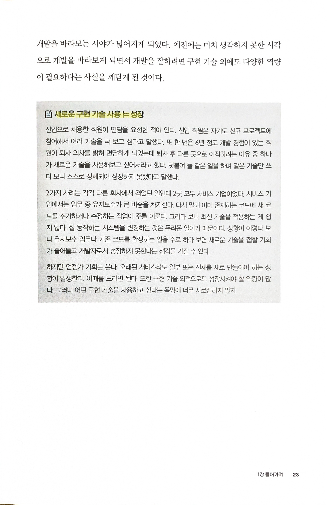

- `새로운 구현 기술의 사용 ≠ 성장`

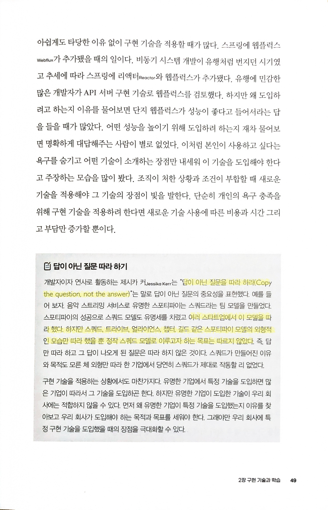

- `“답이 아닌 질문을 따라하라(Copy the question, not the answer)”… 여러 스타트업에서 이 모델을 따라 했다. 하지만 스쿼드, 트라이브, 얼라이언스, 챕터, 길드 같은 스포티파이 모델의 외형적인 모습만 따라 했을 뿐 정작 스쿼드 모델로 이루고자 하는 목표는 따르지 않았다.`

- p50
    - `서비스나 시스템에 새 기술을 도입할 때는 점진적으로 적용해야 한다. 한 번에 다 바꾸겠다는 생각은 위험`
        - Strangler pattern의 필요성
    - `시장 상황… 스칼라 Scala와 아카 Akka 도입 경험 사례 발표`
        - 나도 실제로 Akka로 된 서비스를 담당해봤지만 정말 유지 보수하기 힘들다. 국내에만 해당하는 사례는 아니다. 내가 일했던 Agoda에서도 Scala를 main으로 사용했지만 Akka를 잘 다루는 개발자를 만나기는 쉽지 않았다.

- p52
    - `특정 기술을 사용한다고 우월해지는 것은 아니다.`
        - (좁은 경험이지만) 개인적으로는 Scala 개발자들 중에서 이런 개발자들을 자주 만났다.
    - `모든 문제에 하나의 기술을 사용하려고 하면 안 된다.`
    - `영웅주의도 경계`

- `소프트웨어 유지보수는 이전과 동일한 동작을 유지하는 것이 아니다. 변화하는 세상에서 유용함을 유지하는 것이다.`
    - 유용함이란 결국 비즈니스 가치 달성에 도움이 되는 부분이라고 생각한다. 나보다 100배는 뛰어난 개발자 출신 CTO중에서는 이렇게 생각하지 않는(비즈니스는 비즈니스 부서에서 담당하는 거고 개발 부서는 개발을 잘 하면 비즈니스 가치는 자연히 달성된다고) 분이 계신데, 그 분이 다른 모든 점은 나보다 뛰어나겠지만, 이 부분에 대한 생각은 동의할 수 없다.

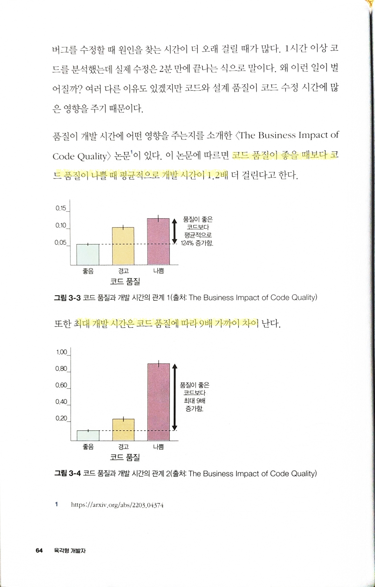

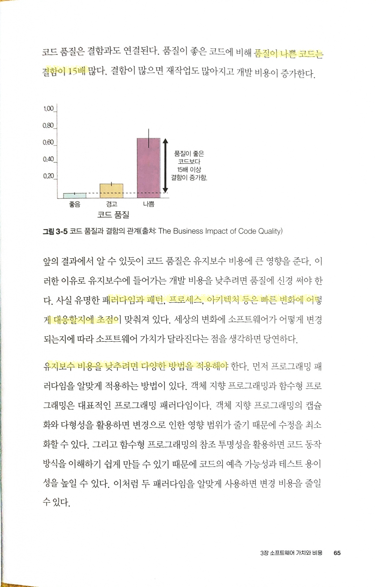

- pp64~65
    - [[2203.04374] Code Red: The Business Impact of Code Quality -- A Quantitative Study of 39 Proprietary Production Codebases](https://arxiv.org/abs/2203.04374)
        - `코드 품질이 좋을 때보다 코드 품질이 나쁠 때 평균적으로 개발 시간이 1.2배`
        - `최대 개발 시간은 코드 품질에 따라 9배 가까이 차이`
        - `품질이 나쁜 코드는 결함이 15배`
    - `패러다임과 패턴, 프로세스, 아키텍처 등은 빠른 변화에 어떻게 대응할지에 초점`
    - `유지보수 비용을 낮추려면 다양한 방법을 적용해야`
    - 내가 개발 시간을 7:3으로 나눠 3 정도는 business feature와 무관한 technical debt, refactoring 등에 시간을 쓰려고 하는 이유

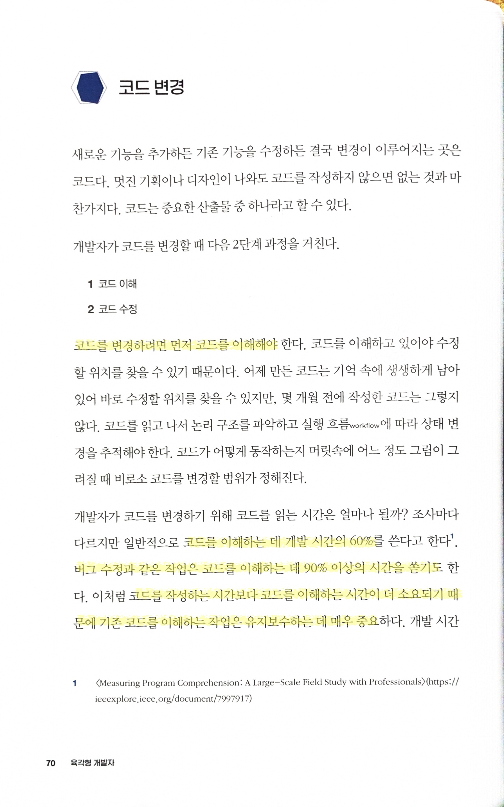

- pp70~71
    - `코드를 변경하려면 먼저 코드를 이해해야`
    - `코드를 이해하는 데 개발 시간의 60%`
    - `버그 수정과 같은 작업은 코드를 이해하는 시간이 더 소요되기 때문에 기존 코드를 이해하는 작업은 유지보수하는 데 매우 중요`
    - `코드를 이해하는 시간을 줄이기 위해서는…`
        - `코드를 제대로 이해할 수 있는 역량이 필요…`
        - `이해하기 쉬운 코드를 작성하는 역량… 품질이 낮은 스파게티 코드를 이해하기 위해서는 품질이 좋은 코드보다 40% 정도 더 많은 시간이 소요`

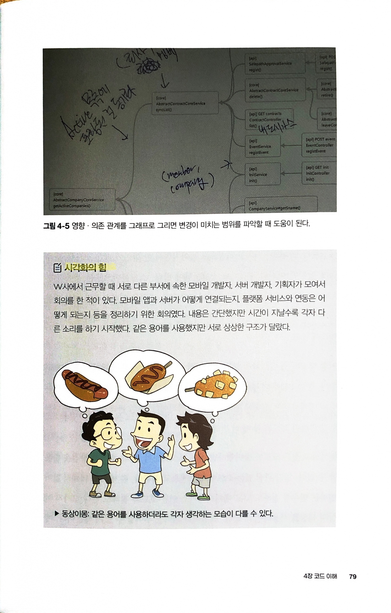

- pp79~80 `시각화의 힘`
    - business쪽에는 business의 flow diagram을, 개발 쪽에는 architecture diagram을 그리고 그 둘을 맞춰보려고 하는 이유
        - 서로 정확한 이해를 돕기 위함

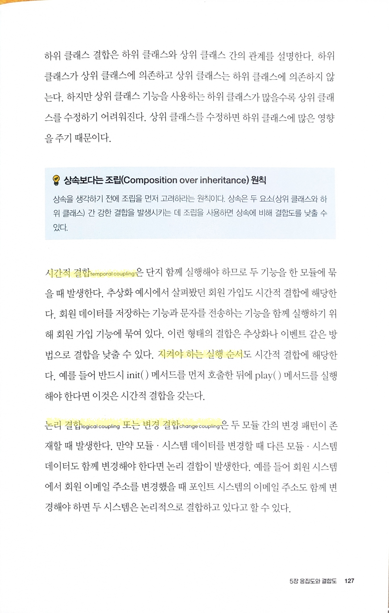

- p127
    - `시간적 결합 temporal coupling… 지켜야 하는 실행 순서`
    - `논리 결합 logical coupling 또는 변경 결합 change coupling… 변경 패턴`

- `레거시는 폄하 대상이 아니다. 레거시가 있었기에 서비스가 굴러가고 수익… 모든 코드에는 나름의 사정`

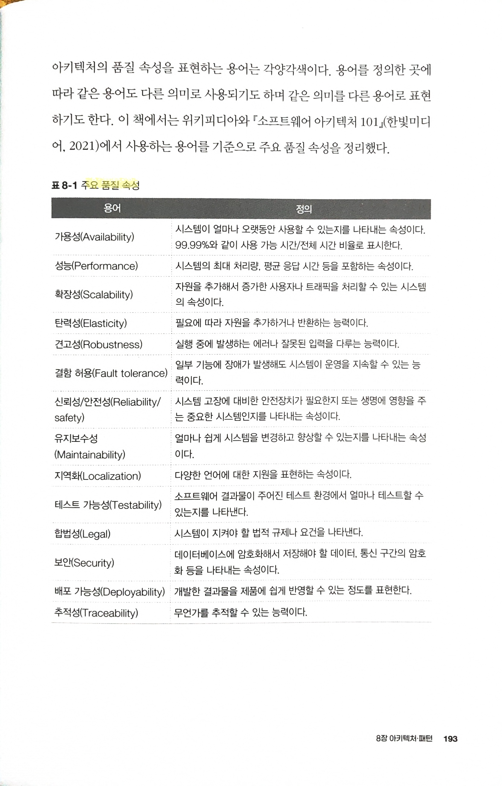

- `주요 품질 속성`

- 이렇게 수많은 책과 여러 가지 사례를 통해 무작정 MSA를 하는 경우의 위험을 알려주는데 현실은…

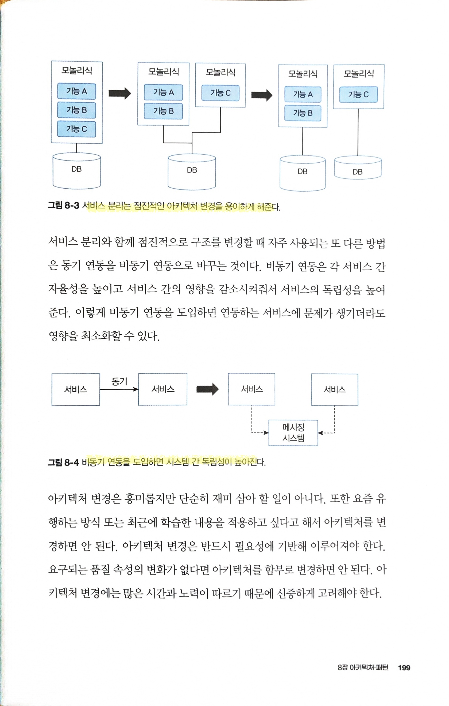

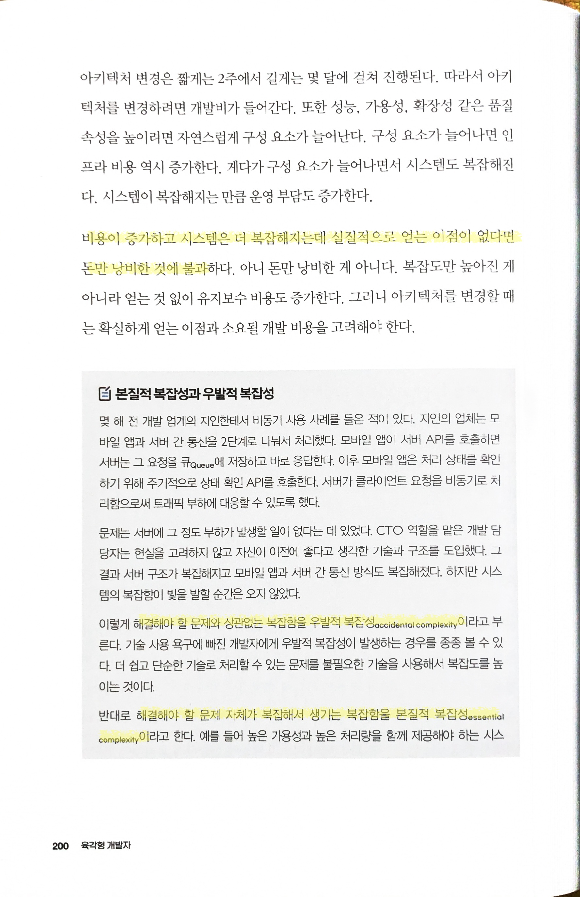

- pp199~201
    - `서비스 분리는 점진적인 아키텍처 변경을 용이하게 해준다.`
    - `비동기 연동을 도입하면 시스템 간 독립성이 높아진다.`
    - `비용이 증가하고 시스템은 더 복잡해지는데 실질적으로 얻는 이점이 없다면 돈만 낭비한 것에 불과`
        - 이번에 정말 뼈아픈 경험을 했다. 필요없는 MSA에 k8s 도입으로 인한 복잡함으로 개발 시간, 즉 비용이 증가하고, bug가 발생하지만 해결이 어렵거나 시간이 많이 걸리고, AWS cost도 필요 이상으로 발생했다
    - `해결해야 할 문제와 상관없는 복잡함을 우발적 복잡성 coincidental complexity`
    - `해결해야 할 문제 자체가 복잡해서 생기는 복잡함을 본질적 복합성 essential complexity`

- `코드가 기대한 대로 동작할 때 비로소 완료`
    - 기대한 대로 동작 = business feature가 사용자들이 사용할 수 있게 되는 경우 ≠ business impact, revenue가 발생

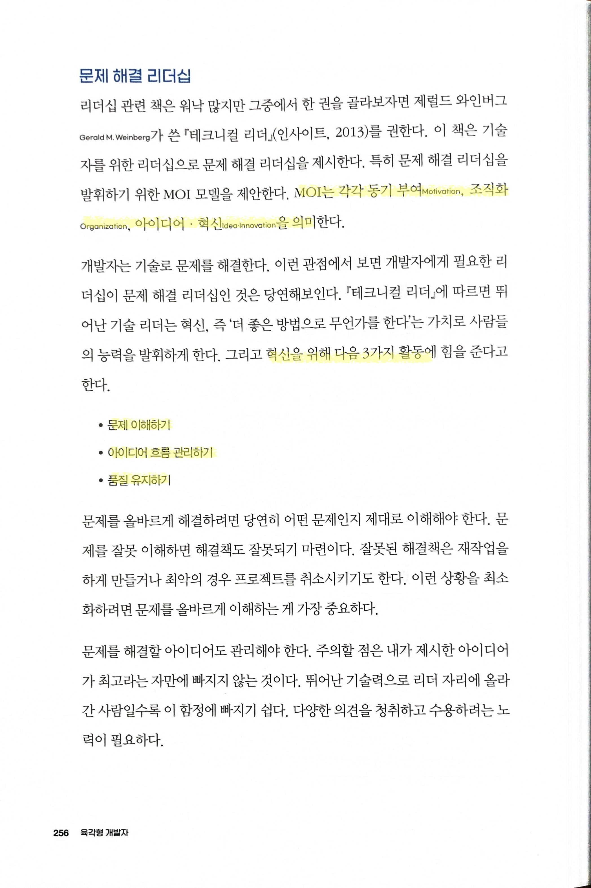

- pp256~257
    - `MOI는 각각 동기 부여 Motivation, 조직화 Organization, 아이디어·혁신 idea·innovation을 의미`
    - `혁신을 위해 다음 3가지 활동`
        - `문제 이해하기`
        - `아이디어 흐름 관리하기`
        - `품질 유지하기`

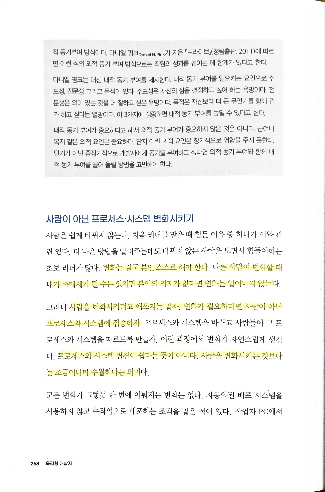

- pp258~259
    - `변화는 결국 본인 스스로 해야 한다. 다른 사람이 변화할 때 내가 촉매제가 될 수는 있지만 본인의 의지가 없다면 변화는 일어나지 않는다.`
    - `사람을 변화시키려고 애쓰지는 말자. 변화가 필요하다면 사람이 아닌 프로세스와 시스템에 집중하자.`
        - 그러나 프로세스와 시스템을 변경하려면 결국 사람의 동의를 얻어야 하는데 이 부분이 정말 힘들다
        - `프로세스와 시스템 변경이 쉽다는 뜻이 아니다. 사람을 변화시키는 것보다는 조금이나마 수월하다는 의미`
        - `기존 프로세스를 변경하는 것은 매우 힘든 일… 본인 스스로 모범 사례가 되어야 한다.`

- `나쁜 상사와 동행할 방법을 소개하는데 핵심은 결국 본인의 역량… 일을 잘 하고 조직에 필요한 인력이 되면 나쁜 상사와의 관계도 개선… 조직에서 중요한 인물이 되면 나쁜 상사라 해도 쉽게 어쩌지 못하고 더 나아가 영향력을 행사해서 원하는 결과도 만들어낼 수 있다.`
    - `쉬운 일이 아니다. 감정을 관리해야 하기 때문`
        - 나의 약점

- `사회적 기술 3가지 겸손, 존중, 신뢰`
    - `신뢰를 주는 것과 동시에 신뢰받기 위해 노력해야 한다… 신뢰는 역량과 성품을 기반`
